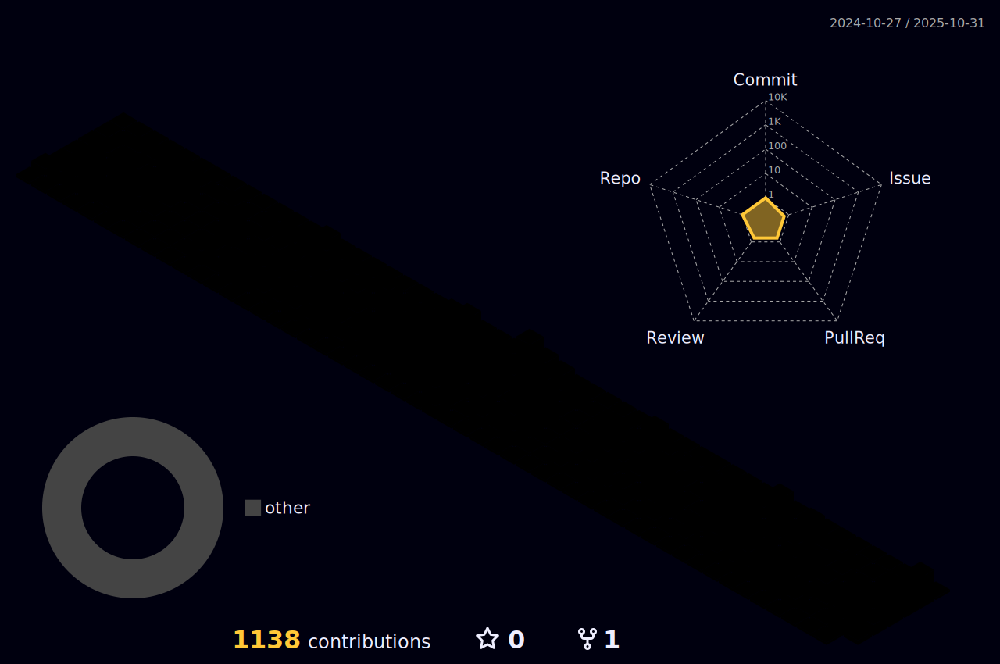

## Hi there 👋

Software Engineer with international experience in creating efficient and scalable web applications. Experienced in all phases of software development, from planning and requirements analysis to implementation and maintenance. Solid knowledge of Ruby on Rails and Javascript ecosystem, providing responsive and user-friendly interfaces. Proven ability to work collaboratively in agile teams and communicate complex ideas clearly and concisely.
  

  
  

  
 |  |  |  
 | ----------- | ----------- |

 
  

   

  

 
##
   

     
  

  
 

 
  
  

  

